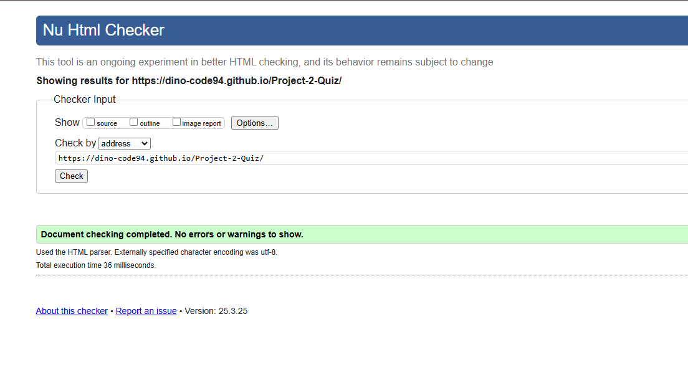
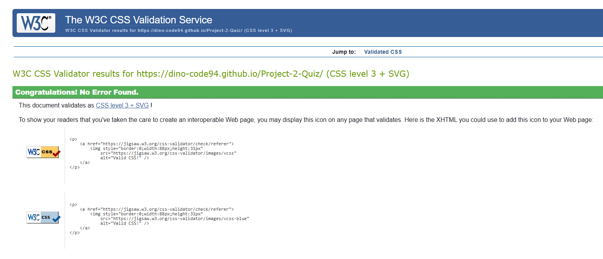
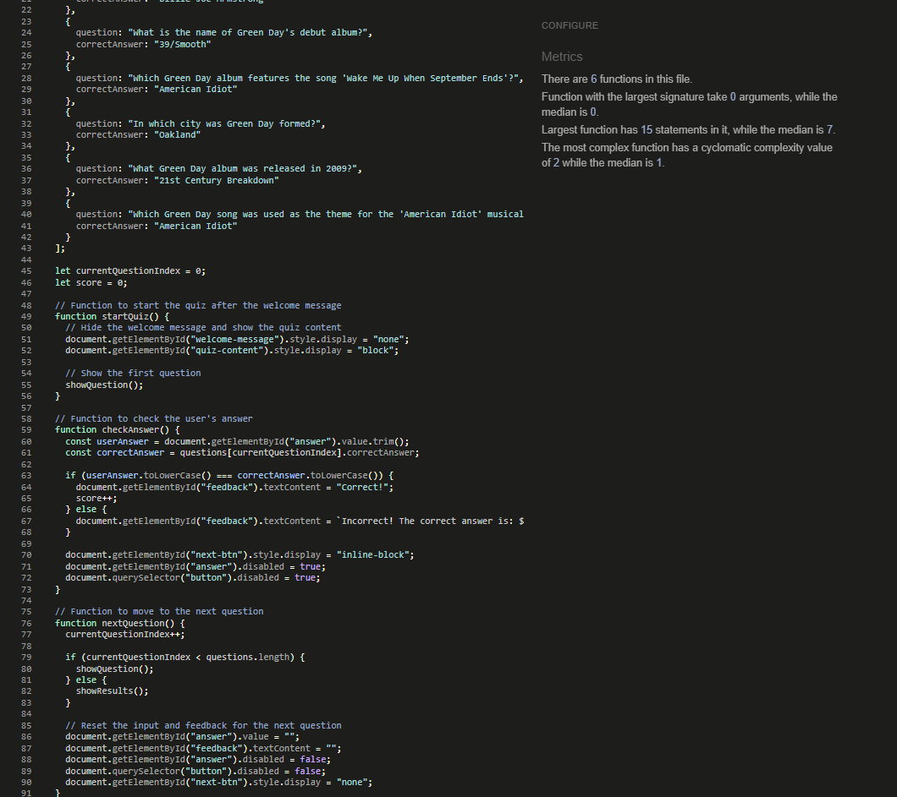

# Green Day Fill in the Blank Quiz

## Description

The Green Day Quiz is an interactive and fun web-based quiz that tests users' knowledge about the legendary punk rock band, 
Green Day. The quiz features questions related to Green Day's albums, songs, lyrics, history, and influence in the music industry. 
The goal is to engage users and challenge them to test how well they know the iconic band. 

The quiz is responsive and designed to work seamlessly on all devices, including desktops, tablets, and smartphones.

## Features

- **Interactive Quiz**: A set of 10 questions about Green Day, with fill-in-the-blank style questions.
- **Responsive Design**: The quiz adapts to different screen sizes, ensuring a smooth experience across devices.
- **Welcome Message**: The quiz begins with a welcoming message that introduces the user to Green Day and explains the quiz.
- **Instant Feedback**: Users get immediate feedback after answering each question, allowing them to learn from their mistakes.
- **End Result**: At the end of the quiz, users can see their score, and there’s an option to start the quiz again.

## User Stories

1. **As a user**, I want to read a welcoming message at the start of the quiz so I can understand what the quiz is about.
2. **As a user**, I want to answer questions about Green Day and get instant feedback on whether I’m correct or not.
3. **As a user**, I want to see my score at the end of the quiz to know how well I performed.
4. **As a user**, I want to be able to restart the quiz after completing it so I can try to improve my score.
5. **As a user**, I want the quiz to be easy to navigate and responsive, ensuring it works well on both desktop and mobile devices.

## User Experience

1. **Start Screen**:
   - Upon landing on the quiz page, users will be greeted with a welcoming message that introduces them to Green Day and the quiz.
   - Users can click on the "Start Quiz" button to begin.

2. **Answering Questions**:
   - Users are presented with fill-in-the-blank questions about Green Day.
   - After answering a question, users will receive immediate feedback to inform them whether they got the answer right or wrong.

3. **End Screen**:
   - Once all questions are answered, users are shown their final score.
   - Users can click "Play Again" to take the quiz again and try to improve their score.

4. **Mobile and Desktop Optimization**:
   - The quiz adapts well to smaller screens like tablets and smartphones, with the layout adjusting automatically.
   - Buttons and text sizes are adjusted for better readability on all devices.

## Typography

The typography used for the quiz is based on the **Playpen Sans** font family, which provides a clean, modern, 
and legible appearance. This font is used for the body text and the quiz questions to ensure clarity and readability across different screen sizes. 

For headings and important titles, a **bold** style has been applied to make them stand out and draw attention to key elements.

## Color Scheme

The color scheme used in the quiz is inspired by **Green Day’s branding**, with bold green tones and dark backgrounds that align with the punk rock aesthetic of the band.

- **Primary Color (Green)**: `#00b140` – This green color represents Green Day’s iconic branding. It is used for buttons, links, and key accents throughout the quiz.
- **Secondary Color (Dark Background)**: `#181818` – A dark background that matches the edgy, rock-and-roll style of the band.
- **Text Colors**:
  - **Primary Text**: `#fff` (white) – Used for the body text and quiz content for high contrast and readability.
  - **Secondary Text**: `#b0b0b0` – A softer gray used for secondary text like paragraph content, ensuring the main text stands out.
  - **Feedback Text**: `#f0f0f0` – Light gray used for the feedback messages after each question.

### Button Hover Effect:
- On hover, the green buttons transition to a darker shade (`#007f2a`) to give users feedback when interacting with the buttons.

### Responsive Design:
- The quiz has been designed to adjust automatically on screens of all sizes, with specific optimizations for:
  - **Mobile devices** (screen width less than 480px)
  - **Tablets** (screen width less than 768px)
  - **Desktops** (larger screens)

## Mockup screenshot

Using the "Am I Responsive" website, here is the example of the site showig responsivity.

| Green day Quiz |
| :---: | 
|  | 

## Tools & Technologies
- [HTML](https://en.wikipedia.org/wiki/HTML) used for main structure and content.
- [CSS](https://en.wikipedia.org/wiki/CSS) layout and desing.
- [GIT](https://git-scm.com) version control system (Git add , Git commit and Git push).
- [JavaScript](https://simple.wikipedia.org/wiki/JavaScript) used for responsive layout
- [GitHub](https://github.com) used for - create, change, merge, and collaborate with files and code.
- [GutHub Pages](https://pages.github.com) used for hosting the page.

## Testing

## Code Validation

### HTML

I have used the recommended [HTML W3C Validator](https://validator.w3.org/) to validate HTML

| Report | Screenshot |
| :---: | :---: |
| index.html |  |

### CSS

I have used the recommended [CSS Jigsaw Validator](https://jigsaw.w3.org/css-validator/) to validate all of my CSS files.

| Report | Screenshot |
| :---: | :---: |
| style.css |  |

### JavaScript

Bellow is the recommended [JSHint](https://jshint.com/) results

| Report | Screenshot |
| :---: | :---: |
| script.js |  |
